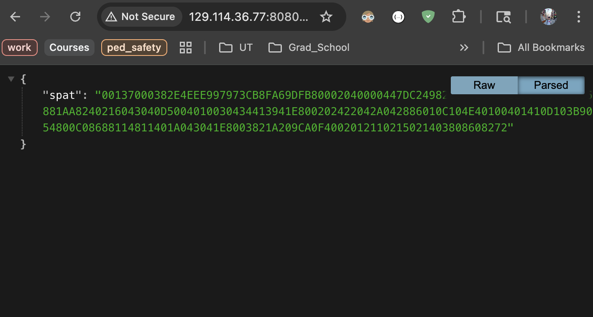
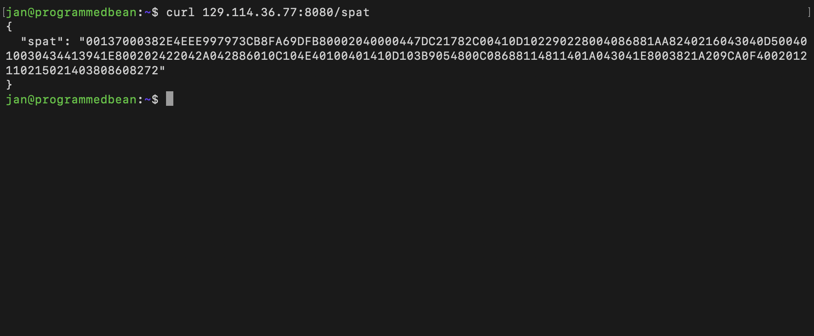
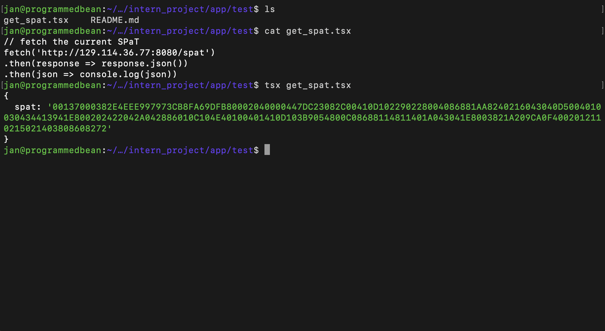

# Test the SPaT Response

## About API
The SPaT API will return the SPaT stream from the Yunex Traffic m60. Every API call will return the SPaT message at a particular point in time.

The API address is ```http://129.114.36.77:8080/spat``` and its response can be obtained by a browser or terminal.

In browser:


In terminal (using the ```curl``` command):


## Fetching SPaT in TypeScript
In order to test the response for this demo, the ```tsx``` dependency was used. It's not necessary for the real implementation, but included just in case.

```bash
$ npm install -g tsx
```

Obtain the SPaT API response in TypeScript.
```bash
$ tsx get_spat.tsx
```

