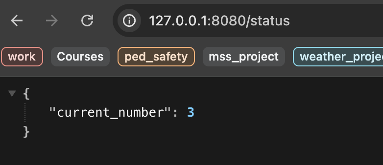
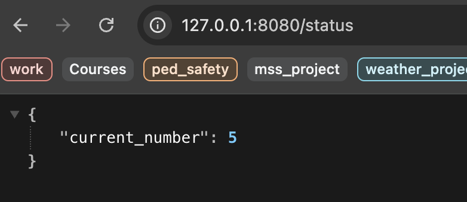

# Looping API Example

Setting up the environment
```bash
$ python3 -m venv looping
$ source looping/bin/activate
$ pip install -r requirements.txt
```

Starting the looping example demo
```bash
python3 looping_api.py
```

The demo will keep updating the value ```current_number``` and serve it as an API. To see the demo in action, go to your browser and search for ```http://127.0.0.1:8080/status```. When you reload the page, the value of ```current_number``` will be returned by the API.

As you can see, the value may be different depending on when the API is called.

